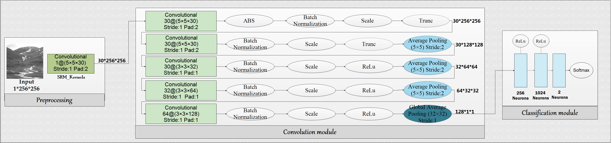

# Yedroudj-Net: An efficient CNN for spatial steganalysis
1- Yedroudj-Net is a convolutional neural network implemented using the Caffe toolbox and running on a GPU card.
It is composed of 7 blocks, a pre-processing block, five convolutional blocks, and a fully connected block made
of three fully connected layers, followed by a softmax (see Figure).

2- Yedroudj-Net network is designed for steganalysis purpose in a 2 classes scenario (Cover or Stego). 
The prelimilarly results show better steganalysis performances compared to the state-of-the-art.

See the following papers for more background:
[ Yedrouj-Net: An efficient CNN for spatial steganalysi](https://arxiv.org/pdf/1803.00407.pdf) 

Authors: Mehdi Yedroudj, Frédéric Comby, and [Marc Chaumont](http://www.lirmm.fr/~chaumont/)

## "Yedroudj-Net" Model Visualization

**Graph**

**Overall architectre:**
Input image
Size: 1 x 256 x 256

Layer 0: Convolution with 30 filters, size 5×5, stride 1, padding 2
Size: 30 x 256 x 256

Layer 1: Convolution with 30 filters, size 5×5, stride 1, padding 2
Size: 30 x 256 x 256
30 depth because 1 set denotes 1 filter and there are 30 filters

Layer 2: Convolution with 30 filters, size 5×5, stride 1, padding 2
Size: 30 x 256 x 256

Layer 3: Average-Pooling with 5×5 filter, stride 2
Size: 30 x 128 x 128

Layer 4: Convolution with 64 filters, size 3×3, stride 1, padding 1
Size: 32 x 128 x 128

Layer 5: Average-Pooling with 5×5 filter, stride 2
Size: 64 x 64 x 64

Layer 6: Convolution with 128 filters, size 3×3, stride 1, padding 1
Size: 64 x 64 x 64

Layer 7: Average-Pooling with 5×5 filter, stride 2
Size: 128 x 32 x 32

Layer 8: Convolution with 256 filters, size 3×3, stride 1, padding 1
Size: 128 x 32 x 32

Layer 9: Global-Average-Pooling with 32×32 filter, stride 1
Size: 128 x 1 x 1
Activation function and Batch_Normalization are used through all blocks

## Notes
HOW TO CITE the this work:

[Mehdi Yedroudj, Frédéric Comby, and Marc Chaumont, " Yedrouj-Net: An efficient CNN for spatial steganalysis ", IEEE International Conference on Acoustics, 
Speech and Signal Processing, ICASSP'2018, 15–20 April 2018, Calgary, Alberta, Canada, 5 pages]

## Extra
The SRM part is available on http://dde.binghamton.edu/download/.

The trained model was obtained while training the Network against [WOW](http://dde.binghamton.edu/vholub/pdf/WIFS12_Designing_Steganographic_Distortion_Using_Directional_Filters.pdf) steganography algorithm, using a payload of 0.4 bpp.
